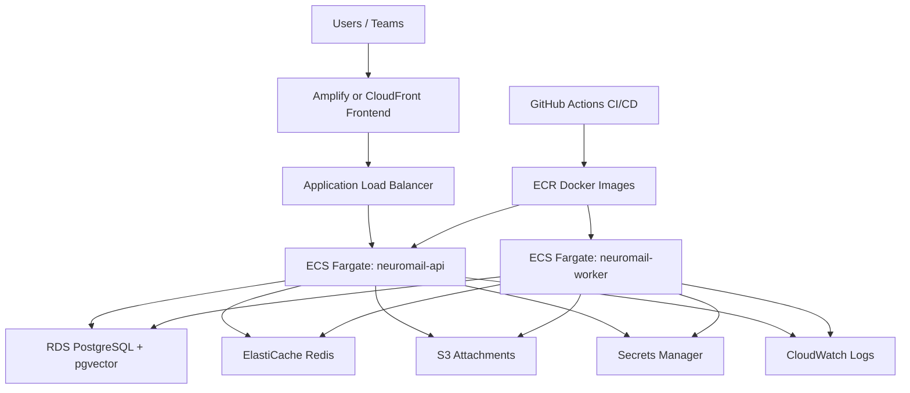

# AWS Architecture

## Production Notes

- API runs as a public ECS service behind an ALB.
- Worker runs as a private ECS service with no public load balancer.
- RDS and ElastiCache should live in private subnets.
- API and worker should read secrets from Secrets Manager.
- S3 attachment bucket should block public access by default.
- Use presigned URLs for attachment upload/download.
- CloudWatch log groups should use retention to control costs.
- Start with one small API task and one worker task, then scale later.

